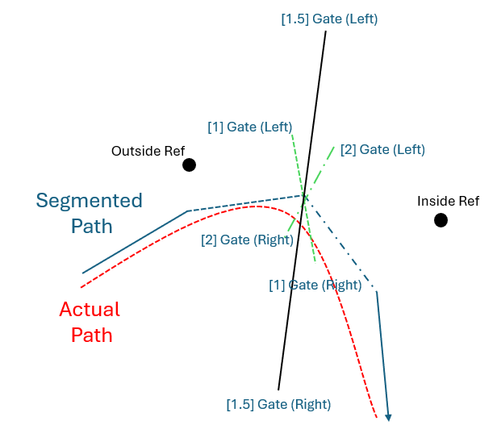

# Data Analytics **1.0**
Obviously looking to improve my ability to understand what part of the mtb ride I'm losing to my PR.
The most basic form of this is the split gap. I'm hoping to evolve this into individual curve analysis,
followed by ascending and descending performance difference. I'd like to finish this with a video
comparison at large time losses with an overlay of a moving point on the map -- similar to Downhill
worldcup visuals.

### Visuals
A few main goals for these:
- Plot over GPS map
- Ability to colorscale a variable alongside the gps plot
- Want to be able to add labels alongside the gps plot to print out useful info (*ex: +5sec*)

### Split Gap
This is the most basic form of comparison, looking to compare the splits at each gap in a segment. The
distance between gaps should be set by the user? Maybe the best gap is really one dynamically based on
time -- in an attempt to minimize GPS measurement frequency issues.

# The "Math" **2.0**
### Gates
I use a garming edge MTB and it has a feature for setting up timing gates. I basically need to create a
feature similar to this in my program where I can break a segment into multiple gates at certain intervals.
Since the gps data is quite broken up, I'm thinking of doing something along the lines of what's below:

Obviously this figure is only showing how I'd initially draw a gate based on a existing run with segment
information. If the garmin measurement frequency is too low and the gate is drawn in the middle of a
radical turn I'm concerned the gate may be missed by a subsequent run.
